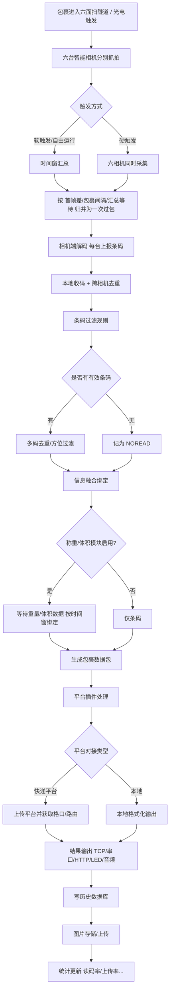
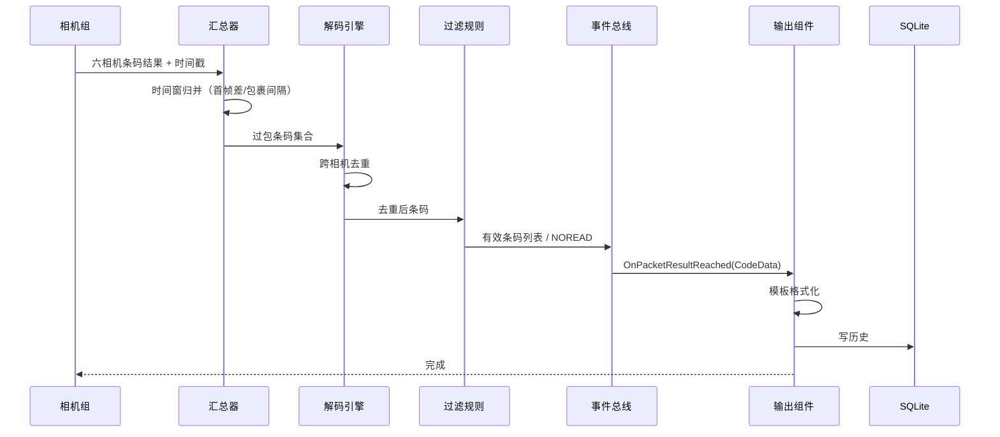
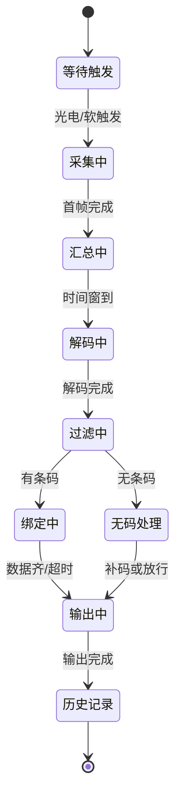

# 包裹过包核心流程

> 一个包裹从"进入六面扫相机视野"到"结果输出"的完整生命周期。这是整个系统最核心的业务逻辑，Node.js 重建时应当先把这个管道跑通。
>
> **V1 场景**：6 台智能相机分布在皮带隧道六个面，相机端完成解码，本地软件只做"收码 → 归并去重 → 过滤 → 输出"。

## 1. 总体流程图

## 2. 关键业务规则

### 2.1 过包（Package）判定
- 一帧图像识别成功后，系统等待 `handleResultDelayTime`（默认 1500ms）收集其他相机结果；
- 通过 `firstFrameTimeDiff`（首帧差）与 `packageTimeDiff`（包裹间隔）区分"同一个包裹的多相机图像"与"下一个包裹"；
- 多相机任意一帧成功即可作为过包起点（`randWorkMode=1`），否则要求全部相机帧齐；
- 输出"包裹结束"结果时触发平台插件 `OnPacketResultReached`。

> [!important] 六面扫 V1 的归并要点
> 同一张面单可能被**顶/侧/前等多台相机同时看到**，因此 V1 最核心的逻辑是：
> 1. 把落在同一时间窗（首帧差/包裹间隔/汇总等待）内的多相机结果归并为"一次过包"；
> 2. 对相同条码**跨相机去重**（同码只上报一次，可记录被哪些相机读到）；
> 3. 一个包裹允许多个不同条码（主码 + 辅码，数量可配置）。

### 2.2 条码过滤
过滤规则按位组合（可叠加），规则值来自 `LogisticsBase.cfg <CodeFilterCfg>`：

| 位值 | 含义 |
|---|---|
| 0 | 不过滤 |
| 1 | 全部字符通过 |
| 2 | 纯数字 |
| 4 | 纯字母 |
| 8 | 字母+数字 |
| 16 | 长度在 [MinCodeSizeParam, MaxCodeSizeParam] |
| 32 | 以指定前缀开头 |
| 64 | 以指定后缀结尾 |
| 128 | 不以指定前缀开头 |
| 256 | 不以指定后缀结尾 |
| 512 | 匹配正则 |

平台规则（`PlatformRules`）支持优先级（0~3）与适用类型（1D / 2D / 1D&2D），多条规则之间按优先级取最优。

### 2.3 多码处理
- 一个包裹允许多个条码（`CodeNum`、`max1DCodeNum`）；
- 多码时的拼接符（默认 `_`）与输出模板配合；
- 可配置"多条码错误"停止皮带（`MultiCodesError`）；
- 重复条码过滤（`cacheSize`，时间窗内不重复上报）。

### 2.4 无码（NOREAD）处理
- 记录 NOREAD 包裹，可单独存图（`saveNoreadPath`）；
- 皮带可配置"无条码停止 + 弹框补码"（`NoreadStop` / `ManualyComplement`）；
- 读码率统计中 NOREAD 计入分母。

### 2.5 信息融合（绑定）
- 条码时间戳、重量时间戳、3D 体积时间戳必须在 `minValidTime ~ maxValidTime` 窗口内才算有效绑定；
- 优先级：`重量优先` 或 `条码优先`；
- 绑定失败产生异常事件（`OnErrorInfoCallBack`），如"重量超时""体积超时""无法匹配"。

### 2.6 输出与上传
- 输出格式模板可包含宏：`{Code}`、`{Weight}`、`{Length}`、`{Width}`、`{Height}`、`{Volume}`、`{Timestamp}`；
- 支持十六进制编码输出；
- 上传失败进入重传队列（`maxUploadTimes` 次，`delayMillisec` 间隔），未上传记录标记在历史表；
- 平台插件决定"格口/路由"结果：如百世上传后返回分拣格口，圆通/邮政通过 SOAP 查询路由。

### 2.7 统计口径
- 读码率 = 有码包裹 / 包裹总数（可配置是否把 RFID 绑定计入）；
- 计泡率 = 有体积包裹 / 包裹总数；
- 漏称率 = 无重量包裹 / 包裹总数；
- 上传率 = 已上传 / 应上传；
- 异常率 = 有异常标志 / 包裹总数。

## 3. 关键时序（V1 读码版）

## 4. 状态机：单包裹生命周期

---

相关文档：[[01-DWS业务逻辑总览]] | [[02-核心模块技术细节]]
