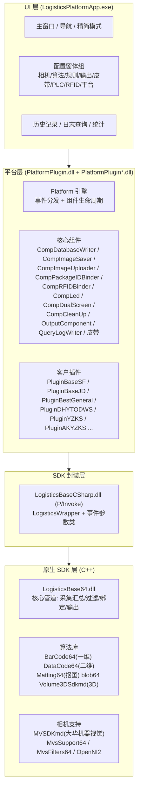

# 系统技术架构

## 1. 总体分层

原系统是 **C#/.NET Framework WinForms 桌面应用 + C++ 原生 SDK** 的混合架构，部署形态为目录直拷（无安装包），核心二进制位于本目录。



## 2. 模块组成（安装目录映射）

| 模块 | 文件 | 职责 |
|---|---|---|
| 主程序 | `LogisticsPlatformApp.exe` | WinForms UI、方案切换、配置管理、启动/停止、看门狗 |
| 平台框架 | `PlatformPlugin.dll` | 组件基类、事件分发、输出通道、数据库写入、图像保存/上传、PLC/RFID、UI 控件 |
| 客户插件 | `PlatformPlugin*.dll`（50+） | 各快递/电商平台对接适配器 |
| SDK 封装 | `LogisticsBaseCSharp.dll` | 原生 SDK 的 C# P/Invoke 封装与事件参数 |
| 原生核心 | `LogisticsBase64.dll` | 图像采集、过包汇总、过滤、信息绑定、输出调度 |
| 读码算法 | `BarCode64.dll`（一维）、`DataCode64.dll`（QR/DM/VC） | 条码识别 |
| 抠图算法 | `Matting64.dll` | 面单/条码区域抠图 |
| 3D 算法 | `Volume3DSdkmd.dll`、`blob64.dll` | 动态/静态体积测量 |
| 相机 SDK | `MVSDKmd.dll`、`MvsSupport64.dll`、`MvsFilters64.dll`、`OpenNI2.dll` | 大华工业相机、3D 相机接入 |
| 自动升级 | `LogisticsPlatformUpdater.exe` | 启动时检查更新 |
| 辅助工具 | `ExcelExport.exe`、`LogCollection.exe`（Tools）、`LogisticsBaseDiagnostic.exe`（analyzer）、`ConfigEncrypter.exe`、`WndFindermd.exe` | 导出、日志收集、诊断、配置加密、窗口查找 |
| 相机工具 | `CameraTools/`（CameraFirmwareUpdater.exe） | 相机固件升级 |
| 日志抓取 | `CamLog/`（SimpleSample/telnet_cmd） | 相机日志抓取 |

## 3. 组件模型（ComponentBase）

平台层所有业务模块继承统一的组件生命周期，由 `Platform` 引擎统一管理：

```text
Init() → Start() → [运行中，事件驱动] → Stop() → Uninit()
```

组件通过 6 个事件与 SDK 层解耦：

| 事件 | 触发时机 |
|---|---|
| `OnPacketResultReached` | 一个包裹处理完成（核心事件） |
| `OnRealTimeImageReached` | 相机实时图到达 |
| `OnCameraConnectionChanged` | 相机连接/断开 |
| `OnAllCameraCodeInfoReached` | 包裹结束后所有相机扫码信息 |
| `OnPanoramaReached` | 全景图+条码拼接图到达 |
| `OnErrorInfoCallBack` | 绑定/采集异常 |

已确认的组件清单（来自日志与反编译）：

| 组件 | 职责 |
|---|---|
| `CompDatabaseWriter` | 写 SQLite 历史/日志，处理重传队列 |
| `CompImageSaver` | 按策略保存原图/运单图/全景图，多线程落盘 |
| `CompImageUploader` | FTP/SFTP/HTTP 上传图片，含失败重试 |
| `OutputComponent` | 模板格式化 + TCP/串口/HTTP/句柄等输出 |
| `CompPackageIDBinder` | PLC 小车号绑定 |
| `CompRFIDBinder` | RFID 数据绑定 |
| `CompLed` | LED 显示屏输出 |
| `CompDualScreen` | 双屏显示 |
| `CompCleanUp` | 过期图片/数据清理 |
| `QueryLogWriter` | 日志查询写入 |
| 皮带组件 | 滚动皮带控制（启动/停止/心跳/补码） |

## 4. 客户插件机制（平台对接）

每个 `PlatformPlugin*.dll` 实现 `PlatformComponent` 接口，通过 `AppSetting.xml` 的 `<PlatformID>` 选择激活哪个插件：

```xml
<Platform>
  <PlatformID val="PluginAKYZKS" />
</Platform>
```

插件可替换/扩展的能力（以顺丰 BaseSF 插件为例）：
- 图片保存逻辑（`CompImageSaverSFBase`）— 顺丰要求 JSON 附加信息；
- 图片上传（`CompImageUploaderSFBase`）；
- 实时结果视图（`RealResultViewSFBase`）；
- 平台上报（`PluginBaseSF`）；
- 百世 BestGeneral 插件甚至自带 `HOD`（启停对接）、`WCS` 分拣控制器、`Sorting` 格口管理、`TimeSync` NTP 校时、补码窗体。

当前目录插件清单（节选）：

| 插件 | 对应客户/场景 |
|---|---|
| `PlatformPluginBaseSF.dll` | 顺丰 |
| `PlatformPluginBaseJD.dll` | 京东 |
| `PlatformPluginBestGeneral/BestOversea/BestDajian` | 百世通用/海外/大件 |
| `PlatformPluginDHYTODWS.dll` | 圆通 |
| `PlatformPluginDHYZKS/HRYZKS` | 邮政/爱客邮政快手 |
| `PlatformPluginDHSTO/DHSTOLB.dll` | 申通 |
| `PlatformPluginDHSNTT.dll` | 极兔 |
| `PlatformPluginDHJTWCS/DHJTWCSBIG` | 京东物流 WCS |
| `PlatformPluginDHXBSort/XBY*` | 新北洋设备系 |
| `PlatformPluginHR*` | 华睿设备系 |
| `PlatformPluginAKYZKS.dll` | 浙江爱客智能（当前激活） |

## 5. 运行时启动顺序（来自日志）

```text
Program.Main
  ├─ LoadLanguage / LoadLogConfig
  ├─ CheckCfg / UpgradeCfg（旧配置迁移）
  ├─ CheckMVViewer / CheckDisk
  ├─ AssignStaticVariable
  └─ MainWindow
      ├─ InitUI / RegisterEvent / InitPlatform
      ├─ 枚举并注册各客户插件（滚动皮带/小车号类型等）
      ├─ StartProject
      │   ├─ SDK 初始化（LogisticsBase64）
      │   └─ 平台组件 Start：CompDatabaseWriter → CompPackageIDBinder
      │       → CompRFIDBinder → CompLed → CompDualScreen → OutputComponent
      │       → CompImageSaver → CompImageUploader → CompCleanUp
      │       → QueryLogWriter → 皮带
      └─ StopProject（逆序 Stop）
```

## 6. 关键技术栈（原系统）

| 类别 | 技术 |
|---|---|
| 语言/框架 | C#/.NET Framework（WinForms） + C++（原生 SDK） |
| 相机 | 大华 MVSDK（工业相机）、OpenNI2（3D）、AForge（USB 相机兼容） |
| 图像 | OpenCV 3.0（opencv_world300.dll）、TurboJPEG、自研算法库 |
| 数据库 | SQLite（System.Data.SQLite）+ 可选 Oracle 驱动 |
| 通信 | System.Net.Sockets、websocket-sharp、FluentFTP、Renci.SshNet、S7.Net（西门子 PLC）、NAudio（语音） |
| HTTP | RestSharp、Newtonsoft.Json |
| Excel | EPPlus |
| 日志 | log4net（平台）、NLog（部分组件）、log4cpp（SDK）、MvpLogger（相机） |
| UI 库 | DevExpress 风格自绘控件（CommonControls.dll）、GDI+ |
| 硬件监控 | OpenHardwareMonitorLib |

## 7. 配置体系概览

```text
DWS/
├── Cfg/AppSetting.xml        平台层配置（输出/存图/皮带/PLC/平台插件等）
├── Cfg/LogisticsBase.cfg     SDK 层配置（相机/算法/过滤规则/称重）
├── Cfg/coderules.json        快递单号规则库
├── Cfg/RoutingList.json      路由/格口对照
├── Cfg/RouteSettingInAndOut.xml 进出港格口路由
├── Cfg/MSCfg.ini             HOD 云端管理配置
├── BarcodeConfig.ini         条码扫描线数
├── 3DCfg/*                   3D 标定（参考面/相机外参/体积参数）
├── log.config                log4net 配置
└── appdata.json              模块加载与相机型号识别规则
```

详见 [[03-配置体系参考]]。

---

相关文档：[[02-核心模块技术细节]] | [[05-大华SDK接口参考]] | [[01-技术选型方案]]
