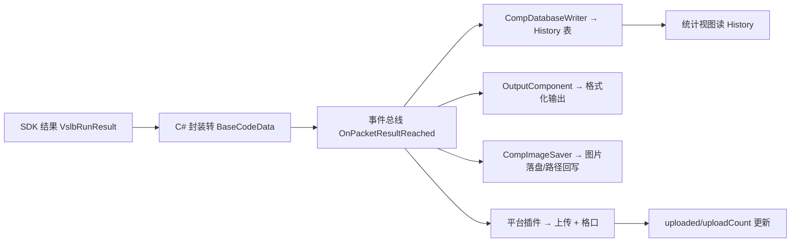

# 数据模型与数据库

## 1. SQLite 数据库（Database/Default.db）

原系统使用 SQLite 存储历史与日志，共 3 张表：

### 1.1 History 表（包裹历史）

| 字段 | 类型 | 说明 |
|---|---|---|
| `id` | INTEGER PK | 自增 |
| `error` | INTEGER | 异常标志（0 正常） |
| `code` | TEXT | 条码 |
| `isCompBillCode` | INTEGER | 是否补码 |
| `weight` | REAL | 重量 |
| `length/width/height` | REAL | 长宽高（mm） |
| `volume` | REAL | 体积（mm³） |
| `uploaded` | INTEGER | 是否已上传 |
| `uploadTime` | INTEGER | 上传时间戳 |
| `uploadCount` | INTEGER | 上传次数（重试计数） |
| `time` | INTEGER | 过包时间戳 |
| `plcStartTime` | INTEGER | PLC 启动时间 |
| `swingTime` | INTEGER | 摆臂时间 |
| `isSwung` | INTEGER | 是否摆臂成功 |
| `origImagePath` | TEXT | 原图路径 |
| `matImagePath` | TEXT | 面单图路径 |
| `panoImagePath` | TEXT | 全景图路径 |
| `exp1 ~ exp6` | TEXT | 扩展字段（客户定制，如物料码/格口/路由） |

### 1.2 Log 表（日志）

| 字段 | 类型 | 说明 |
|---|---|---|
| `id` | INTEGER PK | 自增 |
| `level` | varchar(50) | INFO/WARN/ERROR 等 |
| `module` | varchar(50) | 来源模块 |
| `content` | TEXT | 日志内容 |
| `time` | TEXT | 时间戳字符串 |

### 1.3 sqlite_sequence
SQLite 自增序列管理。

## 2. 内存数据模型（平台层）

反编译确认的核心模型（`PlatformPlugin.dll`）：

| 类 | 字段/含义 |
|---|---|
| `CodeData` / `BaseCodeData` | 条码结果：条码列表、重量、体积、图片、时间、补码标志、扩展 |
| `CodeType` | 1D / 2D / 混合 |
| `VolumeInfo` | length/width/height/volume（mm/mm³） |
| `WeightData` | 重量 + 时间戳 |
| `TimeInfo` | 各数据源时间戳 |
| `RawImage` / `ImageWrapper` | 原始图/包装图 |
| `HistoryRate` | 历史统计比率 |
| `RFID` | RFID 数据 |
| `ComplementCodeBind` | 补码绑定信息 |
| `DatabaseUpdateInfo` | 数据库更新信息（含升级语句） |

SDK 侧结构体（`LogisticsBaseCSharp.dll`）：

| 结构体 | 字段 |
|---|---|
| `VslbRunResult` | image、codes、resultAreas、steadyWeight、waybillImage、volumeInfo、outputResult |
| `VslbVolumeInfo` | length/width/height/volume |
| `singleCameraCodeInfo` | image、codes、resultAreas、waybillImage、outputResult、key、cameraIP |
| `AllCameraCodeInfo` | cameraCodeInfo[]、numCam |
| `VslbIpcCombineInfo` | barcodeMattingImage、ipcImage、combineImage、picInfo |
| `VslbCameraTags` | key、deviceUserID |

## 3. 数据流

## 4. 导出与统计

- 历史查询条件：时间范围、条码、是否补码、上传状态、异常；
- 统计口径：读码率/计泡率/漏称率/上传率/异常率（见 [[02-包裹过包核心流程]] 2.7）；
- Excel 导出：EPPlus 生成 xlsx；支持定时自动导出（`TaskScheduler/AutoExcelExport`）。

---

相关文档：[[01-系统技术架构]] | [[03-配置体系参考]] | [[05-大华SDK接口参考]]
