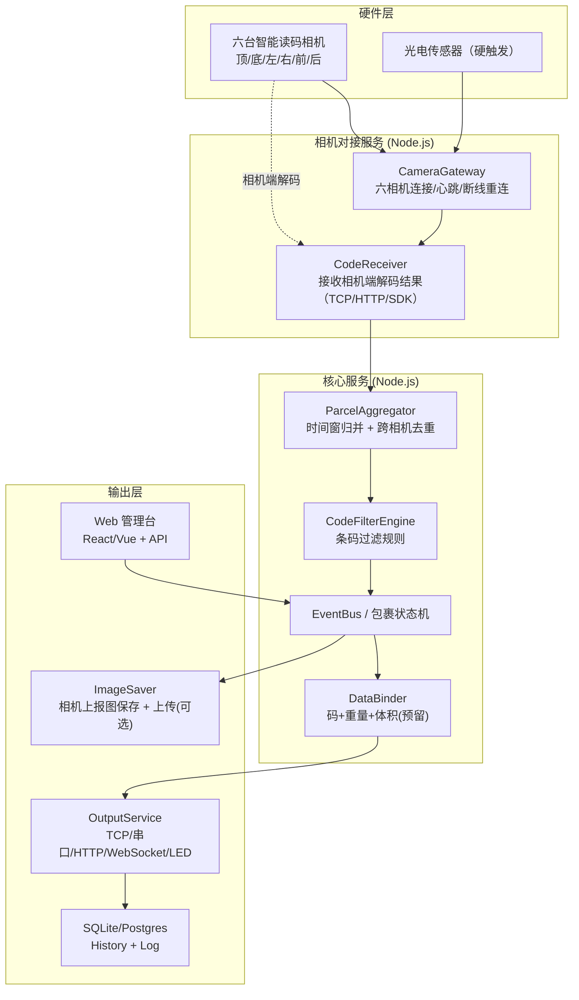

# Node.js 重建技术选型方案

> 目标：用 Node.js/TypeScript 重建大华 DWS 的核心能力。**V1 对标 DWS 六面扫，只做读码；六台智能相机相机端解码，本地软件只收码、不做任何图像解码**。选型要为后续加称重、体积留好接口。

## 0. 总体架构建议



## 1. 技术栈对照表（原系统 → Node.js）

| 原系统 | Node.js 替代 | 优先级（V1） | 备注 |
|---|---|---|---|
| C# WinForms | **Electron + React/Vue** 或 纯 Web 管理台 | 高 | V1 建议先 Web 控制台，管理端后补 |
| .NET 服务/事件 | **TypeScript + Node 18+（LTS）**，`EventEmitter`/`rxjs` | 高 | 全项目 TS |
| 智能读码相机（六面扫，自带解码） | 相机直接输出条码：**TCP/HTTP 回调 或 厂商 SDK**，Node 只解析结果 | **最高（V1 唯一）** | 大华智能相机型号（S/R 系列），6 台分别覆盖六面 |
| 大华 MVSDK（工业相机） | **不启用**；如后续要接普通工业相机，用 sidecar 方案（gRPC/HTTP 桥接） | 不做（V1） | V1 全部用智能相机 |
| BarCode64/DataCode64（读码算法） | **V1 不需要本地解码**。如需本地兜底（V2+）：Dynamsoft / ZXing | 不做（V1） | 解码在相机端完成 |
| Matting64（抠图） | V1 不做；相机可上报条码截图，直接用 sharp 保存 | 低 | V2+ |
| Volume3DSdk（体积） | V2：3D 相机 SDK sidecar 或点云库（如 PCL 服务） | 不做（V1） | 预留 VolumeInfo 接口 |
| 动态称（串口） | `serialport` + 协议解析 | 不做（V1） | 预留 WeightData |
| SQLite | `better-sqlite3`（同步、快） | 高 | 沿用 History/Log 表结构 |
| EPPlus（Excel） | `exceljs` | 中 | 历史导出 |
| FluentFTP / SSH.NET | `basic-ftp` / `ssh2-sftp-client` | 中 | 图片上传 |
| RestSharp / HTTP | `axios` / `undici` | 高 | 平台对接 |
| TCP Socket | `net` 模块（客户端/服务端封装） | 高 | 输出通道 |
| websocket-sharp | `ws` / `socket.io` | 中 | Web 输出、实时推送 |
| S7.Net（西门子 PLC） | `nodes7` / `modbus-serial` | 不做（V1） | V2 皮带控制 |
| NAudio（语音） | `play-sound` / `speaker` | 低 | OK/NG 提示音 |
| log4net | `pino` + `pino-roll` | 高 | 日志 |
| ConfigEncrypter | `crypto`（AES/DES）或直接 JSON 配置 | 中 | V1 可明文 JSON |
| 定时任务 | `node-cron` | 低 | Excel 自动导出 |
| 看门狗/自启 | `pm2` + 系统服务（NSSM/winsw） | 中 | 生产部署 |

## 2. 相机接入方案（V1：六面扫智能相机）

V1 只有一种相机形态：**智能读码相机**（大华 S/R 系列等，相机端自带解码），因此不涉及本地图像算法。

### 2.1 六面扫布局

| 相机位 | 覆盖面 | 说明 |
|---|---|---|
| TOP | 顶面 | 包裹从上方经过时拍摄 |
| BOTTOM | 底面 | 皮带间隙/玻璃段拍摄 |
| LEFT | 左面 | 侧面 |
| RIGHT | 右面 | 侧面 |
| FRONT | 前面 | 入口方向 |
| REAR | 后面 | 出口方向 |

- 每台相机一个固定 IP / Key（序列号），在配置里绑定"方位"；
- 面单无论贴在哪个面，至少一台相机能读到；同一面单也可能被多台相机同时读到（去重逻辑见 [[04-六面扫智能相机对接方案]]）；
- 触发：光电传感器 → 相机 IO 硬触发最稳；或相机自由运行 + 软件时间窗汇总。

### 2.2 Node 侧职责（全部）

```text
连接相机（TCP/HTTP/厂商 SDK）
  → 接收相机解码结果（条码 + 置信度 + 时间戳 + 可选截图）
  → 相机状态监控（在线/离线/心跳/断线重连）
  → 把结果交给 ParcelAggregator（时间窗归并 + 去重）
```

### 2.3 方案 B（预留）：普通工业相机 sidecar

V1 不启用。若后续现场需要普通工业相机：
- 保留大华 MVViewer/MVS SDK 或写一个极简 C#/C++ 采集程序（可复用 `LogisticsBaseCSharp.dll` 封装）；
- sidecar 通过 **gRPC（推荐）** 或 HTTP/WebSocket 把"图或解码结果"推给 Node；
- Node 侧实现与智能相机相同的 `CameraAdapter` 接口，业务层无感。

> [!important] 决策结论
> V1 = **纯智能相机六面扫，本地零解码**。全部精力放在：相机协议对接、时间窗归并、跨相机去重、过滤、输出。

## 3. 本地解码：V1 明确不做

| 项目 | 结论 |
|---|---|
| V1 是否需要本地解码引擎 | **不需要**。解码由六台智能相机在相机端完成 |
| 相机未读到码时 | 该相机上报空结果，本地标记该面 NOREAD，不补解码 |
| 什么情况会需要本地解码 | ① 现场混用普通工业相机；② 需要二次校验/补读相机漏读的截图（V2+） |
| V2+ 备选引擎 | Dynamsoft Barcode Reader（商业、准确率高）或 ZXing（免费） |

> [!note] 结果可信度
> 智能相机上报的条码自带置信度/质量分，本地可直接采信；如现场发现漏读，优先调相机端算法参数（曝光、触发时机、ROI），而不是在本地补解码。

## 4. 项目结构建议

```text
dws-node/
├── apps/
│   ├── server/            # 核心服务（聚合/过滤/输出/历史/API）
│   ├── web/               # Web 管理台（React/Vue）
│   └── collector/         # 相机对接适配器（智能相机 TCP/HTTP/SDK 客户端）
├── packages/
│   ├── core/              # 领域模型、事件总线、状态机
│   ├── code-filter/       # 条码过滤规则引擎（移植 coderules.json）
│   ├── output/            # 输出通道（TCP/串口/HTTP/WebSocket）
│   ├── storage/           # 图片存储/上传
│   ├── database/          # SQLite/Postgres 仓储
│   └── protocol/          # 平台对接协议（SF/JD/Best/通用）
├── config/                # 配置文件（JSON/YAML 替代 XML）
├── docs/                  # 本知识库链接或副本
└── deploy/                # pm2/NSSM/安装脚本
```

> 单体优先：V1 建议一个 Node 服务 + 一个 Web 页面，不引入微服务；目录按模块分即可。

## 5. 配置体系迁移建议

原 XML 配置 → JSON/YAML，保持结构对照：

```yaml
# config/solution.yaml（示意）
solution: dws-readonly       # 六面扫读码版（对齐 DWS，只启用读码模块）
device:
  siteCode: HangZhou
  pipeline: ZA
  deviceName: LP01
cameras:
  - id: cam-top
    position: top            # top | bottom | left | right | front | rear
    type: smart              # V1 只有 smart
    model: DH-SMT-XXXX
    ip: 10.35.1.91
    protocol: tcp            # tcp | http | sdk
    enable: true
  - id: cam-bottom
    position: bottom
    type: smart
    ip: 10.35.1.92
    protocol: tcp
    enable: true
  # ... left / right / front / rear 同理
aggregation:
  trigger: hardware          # free | hardware | software
  handleResultDelayMs: 1500  # 首帧后等待其他相机结果
  firstFrameDiffMs: 300      # 首帧时间差容限
  packageIntervalMs: 300     # 相邻包裹判定间隔
  dedupeWindowMs: 1500       # 跨相机同码去重窗口
  maxCodesPerPacket: 10      # 单包裹最多条码数
codeFilter:
  rulesFile: config/coderules.json
  platformRules:
    - name: Rule1
      type: mixed            # 1d | 2d | mixed
      priority: 0
      regex: "(?=.*)(.*)"
output:
  format: "{Code},{Timestamp}"
  tcpClient: { enable: false, host: "127.0.0.1", port: 20000 }
  tcpServer: { enable: false, port: 30000 }
  http: { enable: false, url: "" }
  serial: { enable: false, port: COM1, baudRate: 9600 }
storage:
  imageDir: ./data/images
  savePolicy: code           # all | code | noread | multi
  fileNameTemplate: "{SiteCode}_{Pipeline}_{Code}_{TimeyyyyMMddHHmmssfff}"
database:
  type: sqlite
  path: ./data/default.db
```

## 6. 领域模型（TypeScript 接口草案）

```ts
interface CameraCodeResult { // 单台智能相机上报的一条结果
  cameraId: string;          // cam-top / cam-bottom ...
  position: 'top' | 'bottom' | 'left' | 'right' | 'front' | 'rear';
  code: string;
  codeType?: '1D' | '2D';
  confidence?: number;       // 相机端置信度（可选）
  imageUrl?: string;         // 相机上报的条码截图（可选）
  timestamp: number;         // 相机端时间戳
}

interface BarcodeInfo {      // 归并去重后的条码
  code: string;
  codeType: '1D' | '2D';
  cameras: string[];         // 被哪些相机读到（去重依据）
  firstSeenAt: number;
  imageUrls?: string[];      // 对应截图
}

interface VolumeInfo { // V2 启用
  length: number; width: number; height: number; volume: number; // mm / mm3
}

interface WeightData { // V2 启用
  weight: number; unit: 'g' | 'kg'; timestamp: number;
}

interface PacketResult { // 对应 VslbRunResult / BaseCodeData
  packageId: string;
  codes: BarcodeInfo[];
  noread: boolean;
  cameraResults: CameraCodeResult[]; // 六相机原始结果（调试/追溯）
  isCompBillCode: boolean;
  weight?: WeightData;
  volume?: VolumeInfo;
  timestamp: number;          // 过包时间
  sortCode?: string;          // 平台返回格口
  uploaded: boolean;
  uploadCount: number;
  error?: number;
}

// 事件总线（对应原生回调）
type PacketResultHandler = (p: PacketResult) => void;
// 'packet.result' | 'camera.status' | 'camera.image' | 'error.info'
```

## 7. 风险与对策

| 风险 | 影响 | 对策 |
|---|---|---|
| 智能相机私有协议不透明 | 对接周期长 | 优先向厂商索取 SDK/协议文档；先用相机自带调试工具（CameraTools）验证收码 |
| 六相机时间不同步 | 归并错包 | 统一 NTP 校时；或依赖硬触发时序 + 时间窗容差 |
| 同一面单被多相机读到 | 重复上报 | 跨相机同码去重窗口（dedupeWindowMs）+ 相机位优先级 |
| 高速皮带漏读 | 读码率不达标 | 调相机曝光/触发时机/ROI；顶+侧相机互补；必要时加本地截图兜底（V2） |
| 相机断线 | 数据中断 | 心跳 + 断线重连 + 状态告警；单相机故障只影响该面 |
| 平台对接多变 | 范围膨胀 | 抽象 Protocol 接口，V1 只实现 1 个真实平台 + 通用 TCP |

---

相关文档：[[02-V1读码版开发步骤]] | [[03-平台对接适配清单]] | [[01-系统技术架构]]
