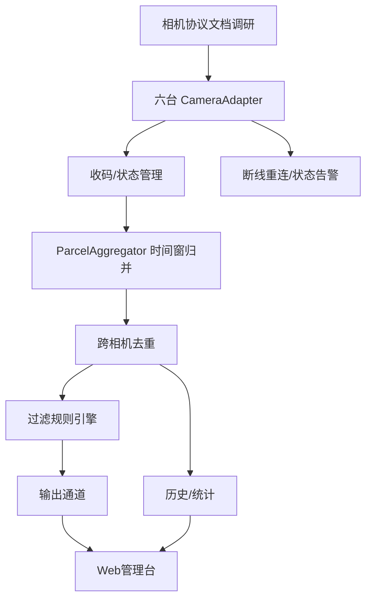

# V1 读码版开发步骤

> V1 范围（已确认）：**对标 DWS 六面扫，只读码**——六台智能相机（顶/底/左/右/前/后）相机端解码 → 本地收码 → 时间窗归并去重 → 过滤 → 结果输出 → 历史与统计。**不含称重、体积、PLC、RFID、皮带控制，也不含本地解码。**
> 对齐原系统"DWS 方案"中只启用读码模块的运行形态。

## 里程碑总览


## M0：需求与验收标准（0.5~1 天）

**目标**：明确 V1 的"完成"定义，防止范围蔓延。

- [ ] 确认六面扫设备清单：6 台智能相机型号、IP、覆盖方位（顶/底/左/右/前/后）、是否含光电触发；
- [ ] 向相机厂商确认对接方式：TCP 指令 / HTTP API / 私有 SDK，索要协议文档与调试工具；
- [ ] 确认现场皮带速度与触发方式（影响汇总时间窗参数）；
- [ ] 确认输出对象：TCP 客户端 / TCP 服务端 / HTTP / 串口（至少定 1 种主通道）；
- [ ] 确认验收指标：读码率目标（如 ≥99%）、单小时吞吐（件/时）、无码处理策略；
- [ ] 确认是否需要图片存储（建议 V1 就要，便于问题定位）。

**验收标准示例**：
1. 面单贴在任意一面，包裹经过隧道，Web 页面实时显示条码；
2. 同一包裹被多台相机读到同一码时**只上报一次**（记录被哪些相机读到）；
3. 条码按配置规则过滤后输出到目标系统；
4. 历史记录可查询、读码率可统计；
5. 相机断线自动重连、异常有日志与告警。

## M1：项目骨架（1~2 天）

- [ ] 初始化 monorepo（pnpm workspace 或单仓）；
- [ ] TypeScript + ESLint + vitest；
- [ ] 配置加载器：JSON/YAML，支持热更新（后续）；
- [ ] 日志：pino + pino-roll（参考原 log4net 滚动策略）；
- [ ] 数据库：better-sqlite3，建 History/Log 表（结构见 [[04-数据模型与数据库]]）；
- [ ] 领域模型与事件总线（`PacketResult` 等接口，见 [[01-技术选型方案]] 第 6 节）；
- [ ] 错误码体系：参考原系统错误码风格（如 1000 配置、3100 相机、7000 输出）。

## M2：六相机接入与收码（3~6 天，取决于相机协议）

### 2.1 相机协议对接（核心工作量）
- [ ] 读相机 SDK/协议文档（大华智能相机：TCP 指令、HTTP API 或私有 SDK）；
- [ ] 用厂商调试工具（如目录内 `CameraTools/CameraFirmwareUpdater`、MVViewer）先手工验证 6 台相机都能出码；
- [ ] 实现 `SmartCameraClient`：连接、心跳、结果接收（条码+置信度+时间戳+可选截图）；
- [ ] 确认相机结果上报格式：单码/多码、字段含义、时间戳来源（相机本地时间/NTP）；
- [ ] 实现相机状态管理：在线/离线、断线重连、状态事件（对应 `OnCameraConnectionChanged`）；
- [ ] 适配器接口（六相机统一实现）：
  ```ts
  interface CameraAdapter {
    readonly id: string;              // cam-top / cam-bottom ...
    readonly position: CameraPosition; // top|bottom|left|right|front|rear
    connect(): Promise<void>;
    disconnect(): Promise<void>;
    on(event: 'code' | 'status' | 'error', handler: (data: any) => void): void;
  }
  ```

### 2.2 六相机管理
- [ ] 配置文件声明 6 台相机（IP/方位/协议/使能）；
- [ ] 相机注册表：`CameraRegistry`（id ↔ adapter 映射）；
- [ ] 启动顺序与健康检查：全部在线后置为"运行"状态，任一离线告警；
- [ ] 每相机独立统计：上报数、出码数、NOREAD 数、断线次数。

## M3：归并去重引擎（2~3 天，业务核心）

- [ ] 实现 `ParcelAggregator`（对应原"过包汇总"）：
  - 时间窗：`handleResultDelayMs`（默认 1500）、`firstFrameDiffMs`（300）、`packageIntervalMs`（300）；
  - 六相机结果按时间窗归并为一个包裹；
- [ ] 实现跨相机去重：
  - 同一条码在 `dedupeWindowMs` 内只保留一次；
  - 记录该码被哪些相机读到（cameras 列表）；
  - 多码保留：单包裹最多 `maxCodesPerPacket` 个不同码；
- [ ] 无码包裹标记 NOREAD（可记录哪些面 NOREAD）；
- [ ] 包裹状态机（等待→收码中→时间窗到→归并去重→过滤→输出→完成）；
- [ ] 单元测试：构造"六相机同时报同一码/相邻包裹/跨窗口码"等用例验证。

> [!tip] 去重策略
> 去重键 = 条码值；去重窗口建议 ≥ 包裹间隔，避免把相邻两个相同单号的包裹误合并；更稳妥可叠加"相机组合 + 时间"判断（见 [[04-六面扫智能相机对接方案]]）。

## M4：过滤规则与输出前处理（1~2 天）

- [ ] 移植 `coderules.json` 规则库（直接复用正则）；
- [ ] 实现平台规则引擎：字符类型/长度/前缀/后缀/包含/正则/优先级；
- [ ] 过滤不合法条码（如噪声码），合法码才进入输出；
- [ ] 主码/辅码策略：优先快递单号规则命中的码作为主码。

## M5：输出与历史（2~3 天）

- [ ] 输出格式模板引擎：`{Code}`、`{Timestamp}` 等宏替换（参考原 `DataFormat`）；
- [ ] 输出通道：
  - TCP 客户端（必做）
  - TCP 服务端
  - HTTP POST
  - 串口（serialport，可选）
  - WebSocket（Web 页面实时展示）
- [ ] 上传重试：`maxUploadTimes` + `uploadCount` 字段；
- [ ] 历史写库：History 表；
- [ ] 统计：读码率、异常率、上传率、吞吐；
- [ ] Excel 导出（`exceljs`，手动导出即可）。

## M6：Web 管理台（3~5 天）

- [ ] 技术选型：React/Vue + Vite + 一个 UI 库（Ant Design / Element Plus）；
- [ ] 页面：
  - 实时结果（条码、图片、时间、状态）；
  - 相机状态（在线/离线、帧率）；
  - 历史查询（时间/条码/状态，分页）+ 导出；
  - 统计面板（读码率/吞吐/异常率）；
  - 配置管理（相机、规则、输出通道、存图策略）；
  - 日志查看；
- [ ] 后端 API：Express/Fastify + REST；
- [ ] 实时推送：WebSocket 推送实时结果。

## M7：现场联调与部署（3~5 天）

- [ ] 现场六相机安装、方位确认、光电触发调试（硬触发接线/软件触发时序）；
- [ ] 皮带速度标定（确定汇总时间窗参数）；
- [ ] 六面覆盖验证：面单分别贴六面各过 N 件，确认每面都能被读到；
- [ ] 多相机同码去重现场验证；
- [ ] 与目标系统联调输出协议（TCP/HTTP 报文核对）；
- [ ] 图片存储与清理策略验证；
- [ ] 压力测试：满皮带连续过包，观察吞吐与内存；
- [ ] 部署：pm2 守护 + winsw/NSSM 注册 Windows 服务（或直接 pm2-startup）；
- [ ] 日志收集：日志目录 + 自动打包脚本（参考原 `LogCollection.exe`）；
- [ ] 编写《现场部署手册》与《运维手册》。

## 任务依赖图



## 工时估算

| 里程碑 | 预估（人日） |
|---|---|
| M0 需求与验收 | 0.5~1 |
| M1 项目骨架 | 1~2 |
| M2 六相机接入与收码 | 3~6 |
| M3 归并去重引擎 | 2~3 |
| M4 过滤与输出前处理 | 1~2 |
| M5 输出与历史 | 2~3 |
| M6 Web 管理台 | 3~5 |
| M7 现场联调部署 | 3~5 |
| **合计** | **约 17~28 人日** |

> 实际取决于：相机协议文档是否齐全（缺文档可能 +3~5 天）、现场联调顺利程度、是否要做图片上传。

---

相关文档：[[01-技术选型方案]] | [[04-六面扫智能相机对接方案]] | [[01-DWS业务逻辑总览]] | [[02-包裹过包核心流程]]
