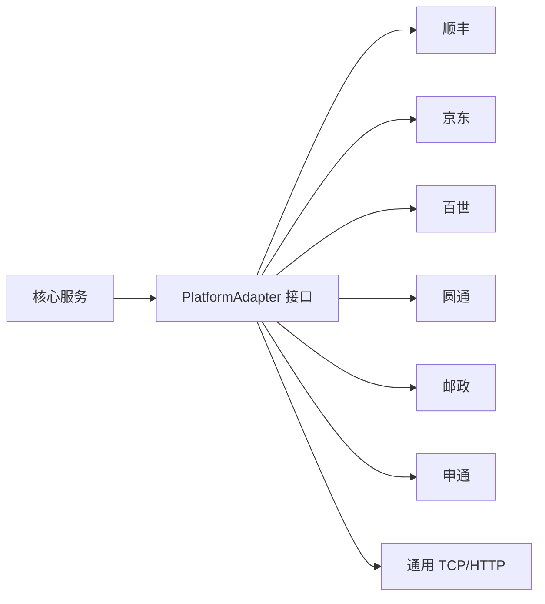

# 平台对接适配清单

> 原系统通过 `PlatformPlugin*.dll` 插件机制对接快递/电商平台。Node.js 重建时按同样的"协议适配器"模式设计即可。

## 1. 插件机制要点



平台插件可定制的能力（对照原 `PlatformComponent` 接口）：

| 能力 | 说明 |
|---|---|
| `onPacketResult` | 包裹结果上报（核心） |
| `onImageSaved` / `uploadImage` | 图片上传（顺丰/京东有特殊要求） |
| `getSortCode` | 查询格口/路由 |
| `startStopDws` | 远程启停（百世 HOD） |
| `onError` | 异常上报 |
| `configSchema` | 插件专属配置（原 `CustomConfig` 节点） |
| UI 扩展 | 插件专属视图（V1 可不做） |

## 2. 原系统平台插件清单（适配参考）

| 插件 DLL | 平台 | 协议特征 |
|---|---|---|
| `PlatformPluginBaseSF` | 顺丰 | TCP 客户端 + JSON 图片信息，设备码/工号，SSS 报表 |
| `PlatformPluginBaseJD` | 京东 | HTTP 上传（dms.etms.jd.com），签名（Key/Signature），图片上传接口 |
| `PlatformPluginBestGeneral` | 百世通用 | HTTP REST（serverUrl/key/secret），格口/分拣/补码/HOD/WCS 全套 |
| `PlatformPluginBestOversea` | 百世海外 | 同上，海外版 |
| `PlatformPluginBestDajian` | 百世大件 | 同上，大件版 |
| `PlatformPluginDHYTODWS` | 圆通 | TCP（IP/Port）+ 图片目录约定，OperationType=745，格口下发 |
| `PlatformPluginDHYZKS` / `AKYZKS` | 邮政（爱客） | SOAP（wsdl）+ HTTP，设备号/工号/机构号，滚筒分拣（左/右/前） |
| `PlatformPluginDHSTO` / `DHSTOLB` | 申通 | TCP（ip/port=37777），设备名/版本 |
| `PlatformPluginDHSNTT` | 极兔（SNTT） | WebSocket 客户端 + HTTP 心跳，半带/车号/设备号 |
| `PlatformPluginDHJTWCS` | 京东物流 WCS | TCP 服务端/客户端 + 分拣 |
| `PlatformPluginDHXF` | 信丰 | HTTP upload（secretKey 签名，Equipment/enterSite/carNo） |
| `PlatformPluginDHZTOUDP` | 中通 | UDP 报文 |
| `PlatformPluginDHJD` | 京东 | HTTP + 签名（ql_dms/HD-WXZY） |
| `PlatformPluginHR*`（系列） | 华睿/合作设备 | 各种 TCP/HTTP/MES 对接 |
| `PlatformPluginXBY*`（系列） | 新北洋设备 | 顺丰/京东/邮政设备协议 |
| `PlatformPluginDHKeJie` | 科捷 | HTTP（Kengic ReceiveShipmentInfromation） |
| `PlatformPluginZhongHang*` | 中航 | TCP/定制 |

## 3. Node.js 平台适配器接口草案

```ts
interface PlatformAdapter {
  readonly id: string;                 // 对应 PlatformID，如 'PluginBaseSF'
  readonly name: string;
  init(config: Record<string, unknown>): Promise<void>;
  uninit(): Promise<void>;
  onPacketResult(packet: PacketResult): Promise<UploadResult>;
  onImageSaved?(image: SavedImage): Promise<UploadResult>;   // 可选
  getSortCode?(packet: PacketResult): Promise<string | undefined>; // 可选
  startStopDws?(action: 'start' | 'stop'): Promise<void>;   // 可选
  configSchema?: ConfigField[];        // 管理台渲染配置表单
}

interface UploadResult {
  success: boolean;
  sortCode?: string;       // 平台返回格口
  error?: string;
  retryable: boolean;
}
```

## 4. 适配器注册与选择

```ts
// config.yaml
platform:
  id: "best-general"          // 激活哪个平台
  config:
    serverUrl: "http://10.33.39.222:8080"
    key: "d340..."
    secret: "dws31007901"
```

```ts
const adapter = registry.get(config.platform.id);
adapter.init(config.platform.config);
bus.on('packet.result', (p) => {
  const res = await adapter.onPacketResult(p);
  p.sortCode = res.sortCode;
  p.uploaded = res.success;
  p.uploadCount += 1;
});
```

## 5. V1 建议

- V1 只实现 **1 个真实平台适配器**（用户现场实际要对接的那个）+ **通用 TCP/HTTP 模板输出**；
- 把平台参数全部收敛到配置文件，不写死在代码；
- 保留 `getSortCode` 与 `onImageSaved` 空实现，接口先立住，V2 填充；
- 若现场是"先本地验证再对接"，用"模拟平台"（打印/回显）联调，再切真实平台。

## 6. 常见平台协议特征速查（来自原配置）

| 平台 | 关键字段 | 上报内容 |
|---|---|---|
| 顺丰 | WorkNo/MachineCode/CarNo | 条码、重量、图片、工号 |
| 京东 | opeSiteId/opeUserId/Signature | 条码、重量、图片、模板号、格口 |
| 百世 | site/key/secret/pipeLine | 条码、重量、体积、图片、格口、启停 |
| 圆通 | OperationType/SiteCode | 条码、重量、图片目录、格口 |
| 邮政 | equipment/operator/orgcode | 条码、重量、图片、滚筒分拣方向 |
| 极兔 | dwsNo/carNo/WebSocket | 条码、心跳、半带信息 |
| 中通 | LocalEndPoint/RemoteEndPoint | UDP 报文 |

---

相关文档：[[01-技术选型方案]] | [[02-V1读码版开发步骤]] | [[01-系统技术架构]]
