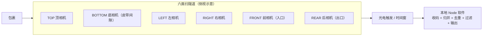
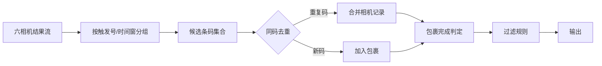

# 六面扫智能相机对接方案（V1 核心）

> V1 的唯一设备形态：**6 台智能读码相机**分布在皮带隧道六个面，相机端完成解码，本地软件只做"收码 → 归并去重 → 过滤 → 输出"。本文是 V1 最核心的技术方案。

> [!note] 现场设备实测（已确认）
> 现场读码器为 **DH-MV-RH7B00MG200**（大华 iRAYPLE 系列），EasyID 配置为 **TCP 客户端模式**主动连上位机；实测了 UDP 3956 私有发现协议；支持多设备组网（主相机 + 最多 16 从相机、"输出绑定时间"聚合）。详见 [[读码器开发资料汇总]]。
> 本文的"六相机布局/归并去重"为通用方案；若现场启用读码器自带组网，则聚合可在相机端完成，上位机只解析主相机汇总报文（见 [[读码器开发资料汇总]] 第 7 节）。

## 1. 场景与目标



**目标**：无论面单贴在包裹哪个面，至少一台相机能读到；同一个码被多台相机同时读到也只输出一次。

**边界**：不做本地解码、不做图像识别、不做称重/体积、不控制皮带（V1）。

## 2. 六相机布局与覆盖

| 相机位 | 覆盖的面 | 安装要点 |
|---|---|---|
| TOP | 顶面 | 隧道上方，向下拍 |
| BOTTOM | 底面 | 皮带中段开玻璃/间隙，向上拍 |
| LEFT / RIGHT | 左右侧面 | 隧道两侧斜向拍 |
| FRONT | 前面 | 入口处，向前拍（包裹进入方向） |
| REAR | 后面 | 出口处，向后拍（包裹离开方向） |

配置模型：

```yaml
cameras:
  - id: cam-top
    position: top
    ip: 10.35.1.91
    protocol: tcp          # tcp | http | sdk
    enable: true
  - id: cam-bottom
    position: bottom
    ip: 10.35.1.92
    protocol: tcp
    enable: true
  # left / right / front / rear 同理
```

## 3. 触发与时间同步

### 3.1 触发方式

| 方式 | 说明 | 推荐度 |
|---|---|---|
| **硬触发**（光电 → 相机 IO） | 包裹遮断光电，6 相机同时抓拍，时序最一致 | ⭐ 推荐 |
| 软触发（软件发指令） | Node 收到光电信号后命令相机抓拍 | 可用 |
| 自由运行 + 时间窗 | 相机连续识别，软件按时间窗归并 | 简单但易混包 |

### 3.2 时间同步

- 六台相机统一 **NTP 校时**（参考原系统 `SmartCamera timeSyncMode`）；
- 若相机支持硬触发，则相机间天然同步，本地只按"触发序号"归并；
- 本地为每个相机结果打上**接收时间戳 + 相机时间戳**两个字段，便于对账。

## 4. 相机对接协议

智能相机（大华 S/R 系列等）通常提供以下一种或多种对接方式，需向厂商确认：

| 方式 | 说明 | Node 实现 |
|---|---|---|
| TCP 指令/回调 | 相机作为 TCP 服务端推送结果，或接收指令后回报 | `net` 模块实现客户端 |
| HTTP API | 查询/订阅识别结果（轮询或 Webhook） | `axios` / `undici` |
| 厂商 SDK | 官方 SDK（多为 C/C++/C#） | V1 尽量避免；若必须，用 sidecar 桥接 |
| 结果推送 | 相机主动把"条码+截图"推送到指定地址 | TCP/HTTP 接收端 |

结果消息字段建议（相机端 → 本地）：

```json
{
  "cameraId": "cam-top",
  "triggerNo": 1024,
  "codes": [
    { "value": "YT1234567890", "type": "1D", "confidence": 98 }
  ],
  "imageUrl": "http://10.35.1.91/snap/1024.jpg",
  "cameraTime": "2026-08-30T10:00:00.123+08:00"
}
```

> [!warning] 先手工验证再写代码
> 用厂商调试工具（目录内 `CameraTools/`、MVViewer 等）先确认：6 台相机分别能出码、上报格式是什么、多码怎么返回、无码时是否上报空结果。协议文档缺失时务必向厂商索取，否则对接周期不可控。

## 5. 收码 → 归并 → 去重（核心算法）

### 5.1 数据流



### 5.2 归并（ParcelAggregator）

参考原系统参数（`LogisticsBase.cfg`）：

| 参数 | 默认 | 作用 |
|---|---|---|
| `handleResultDelayMs` | 1500 | 首个结果到达后，等待其他相机结果的窗口 |
| `firstFrameDiffMs` | 300 | 同一包裹多相机首帧时间差容限 |
| `packageIntervalMs` | 300 | 相邻包裹判定间隔 |

归并规则：
1. 第一个结果到达 → 打开"过包窗口"；
2. 窗口内所有相机结果归入同一包裹（按触发号优先，时间戳兜底）；
3. 窗口关闭 → 包裹完成 → 进入去重与过滤。

### 5.3 跨相机去重

```ts
interface DedupeState {
  code: string;
  cameras: string[];       // 读到该码的相机集合
  firstSeenAt: number;
  lastSeenAt: number;
}
```

规则：
- 去重键 = **条码值**；
- 去重窗口 `dedupeWindowMs`（建议 ≥ 包裹间隔，如 1500ms）；
- 同一包裹内同码只保留一条，记录 `cameras: ['cam-top', 'cam-front']`；
- 相邻包裹若出现相同单号（例如同一寄件人批量件），叠加"相机组合 + 触发号 + 时间间隔"判断，避免误合并；
- 单包裹最多保留 `maxCodesPerPacket` 个不同条码（默认 10，参考原 `CodeNum`）。

### 5.4 无码（NOREAD）处理

- 六相机都无有效码 → 标记 NOREAD，记录每面是否出码（便于现场排查漏读面）；
- NOREAD 包裹照常写历史、计读码率分母；是否输出由配置决定；
- 可配置"无码停止/弹框补码"（V1 可选）。

## 6. 相机状态管理

```ts
type CameraStatus = 'connecting' | 'online' | 'offline' | 'error';

interface CameraHealth {
  cameraId: string;
  status: CameraStatus;
  lastHeartbeatAt: number;
  codeCount: number;        // 累计出码数
  noreadCount: number;      // 累计无码数
  reconnectCount: number;   // 断线重连次数
}
```

- 心跳：相机协议支持则用协议心跳，否则用结果流超时判定（如 5s 无任何消息 → 离线）；
- 断线重连：指数退避（参考原 `reConnectCnt`），上限可配置；
- 状态事件：`camera.status` 广播到 Web 管理台 + 日志 + 可选告警；
- 单相机故障降级：顶/侧相机互为补充，其余 5 台仍工作，读码率可能下降但系统不中断。

## 7. 容错与现场调试

- **留痕**：每个包裹保存六相机原始结果（`cameraResults`），出问题时能回放"哪台相机给了什么码"；
- **截图**：相机支持时保存条码截图，用于漏读复盘（V1 建议至少保存 NOREAD 截图）；
- **统计面板**：按相机展示出码率，快速定位"某面总是漏读"（一般是安装角度/曝光/触发时机问题）；
- **触发对账**：记录触发序号，检查是否有相机漏触发/重复触发。

## 8. 读码图像获取（Node 方案）

> 读码器上报"码结果"与"图像"通常是**两条独立通道**：码结果走 TCP/串口等（第 4 节），图像走 **FTP 推图 / SDK 取帧 / 视频流**。V1 取图主要用于追溯（NOREAD 复盘、面单留档），按"触发序号/时间戳"与码结果关联。

> [!note] 原大华 DWS 用的是哪种取图？
> 原 DWS 平台是 **SDK 主动取帧**：上位机通过相机 SDK（MVSDK）主动连接相机拉取图像帧，图和码一起随结果回调（`VslbRunResult.image` 原图、`waybillImage` 面单图、`AllCameraCodeInfo` 每相机图、`IpcCombineInfo` 全景+抠图），再由 `CompImageSaver` 按策略存本地；**它不是读码器式 FTP 推图**。对智能相机（S/R 系列）也是走 SDK 通道取图（`SmartCamera` 的 `outImgType`/`jpegQuality`/SCPD 组包），不是 FTP。结论：DWS 的取图体验 = "SDK 实时取帧 + 结果同报"，与现场 RH7B00 读码器推荐的 FTP 推图是两种模式，V1 按追溯需求选 FTP 即可，若要做实时画面再走 SDK sidecar。

### 8.1 方式一：FTP 推图（V1 推荐，官方支持）

读码器自身支持"存图 + FTP 上传"（EasyID 配置：`OKRead/NGRead 图像保存位 → 通过FTP发送`，可配 FTP 服务器、目录、命名格式）。

- 上位机跑一个 FTP 服务器：Node 包 **`ftp-srv`**（收到文件后回调），或部署 FileZilla Server 后用 **`chokidar`** 监控落盘目录；
- 每台读码器配置独立上传目录（如 `cam-top/`、`cam-bottom/`…），避免六面文件混淆；
- 图片命名模板尽量包含**触发序号/时间戳/码值**，作为与 TCP 码结果关联的 key；
- 优点：官方功能、与 TCP 解码并行、不占用 SDK 连接、稳定；缺点：非实时拉流，存在上传延迟。

### 8.2 方式二：EasyID SDK 取帧（sidecar 桥接）

读码器 SDK 提供 `eidStartGrabbing` / `eidGetFrame` / `eidGetFrameInfo`（帧内带 `codeList`）。

- Node 无法直接调 C/C++ SDK → 用 **sidecar**（Python 或 C# 小服务）抓帧，通过 **WebSocket / gRPC / HTTP** 把帧推给 Node；
- 适合需要实时画面、自定义 ROI 截图、或对帧做二次处理的场景；
- 注意实测坑（见 [[读码器开发资料汇总]]）：SDK 1.1.0 在本机**枚举不到该机型**；相机**单客户端独占**（EasyID GUI 连着时 SDK 连不上）。V1 若走 SDK，必须先现场验证能否取到帧；
- 备选：写 Node N-API 原生插件直接封装 C SDK（工作量大，V1 不推荐）。

### 8.3 方式三：RTSP / 视频流（需确认支持）

- 部分智能读码器提供 RTSP 实时流（EasyID 的实时画面即类似通道）；
- Node 侧用 `ffmpeg-static` + `node-rtsp-stream` 拉流，或按需 `ffmpeg -ss` 抓帧；
- 实测端口扫描未发现明显 HTTP/RTSP 端口（80/2048/3956/5000/8000/9000 均未开），**需向厂家确认该机型是否支持 RTSP/ONVIF**；
- 优点：接近实时、灵活；缺点：协议与编码方式待确认。

### 8.4 方式四：HTTP 快照 / ONVIF（需确认支持）

- 网络相机常见 `http://ip/snap` 快照接口；该机型 80 端口未开，大概率不支持，需厂家确认；
- 若支持，Node 用 `axios` 按触发事件抓图，最简单。

### 8.5 方式五：GigE Vision 直连取图（不推荐）

- 读码器是千兆网相机，理论上可当工业相机拉流；
- 实测它对标准 GVCP 发现包不响应（走私有 UDP 3956 协议），Node 生态的 GigE 库大概率不兼容；
- 除非厂家提供标准 GigE 模式，否则不投入。

### 8.6 码结果与图像关联策略

- 优先用**触发序号**关联：TCP 码报文带触发号，图片名也带触发号，最可靠；
- 次选**时间戳窗口**关联（±N ms 内匹配）；
- 六面扫若启用读码器组网（主相机聚合），确认主相机汇总报文/图片是否也统一编号；
- V1 建议存图策略：**全部或 NG（无码）**；图片按 `{yyyy}/{MM}/{dd}/{相机位}/` 分目录，保留天数可配。

## 9. 验收清单（V1）

- [ ] 面单贴顶/底/左/右/前/后各过 N 件，每面读码率 ≥ 目标值；
- [ ] 同一包裹多相机同码只输出一次，且记录相机列表正确；
- [ ] 相邻包裹（不同码）不被误合并；
- [ ] 无码包裹正确标记 NOREAD 并计入统计；
- [ ] 任一台相机断电：5 秒内离线告警，恢复后自动重连出码；
- [ ] 六相机时间/触发同步：100 件连续过包无串包；
- [ ] 输出通道按模板正确送达目标系统，历史可查、统计正确；
- [ ] 图像通道：TCP 码结果与 FTP 图片能按触发序号正确关联；NG 件能取到对应图片。

## 10. 与原系统概念映射

| 原系统概念 | V1 Node 实现 |
|---|---|
| 相机 Key/IP + `VslbCameraTags` | `CameraRegistry`（id/position/ip） |
| `SmartCamera`（智能相机 S/R） | 六台 `SmartCameraClient` |
| `ReadCodeMode` 触发/汇总 | `ParcelAggregator` 时间窗 |
| 多相机同码过滤（`cacheSize`/方位过滤） | `DedupeEngine`（跨相机同码去重） |
| `AllCameraCodeInfo` 回调 | 包裹级 `cameraResults` 记录 |
| `OnCameraConnectionChanged` | `camera.status` 事件 |
| `CodeFilterCfg` / `coderules.json` | `CodeFilterEngine`（规则复用） |
| `VslbRunResult` / `BaseCodeData` | `PacketResult` 领域模型 |

---

相关文档：[[01-技术选型方案]] | [[02-V1读码版开发步骤]] | [[02-包裹过包核心流程]] | [[05-大华SDK接口参考]]
